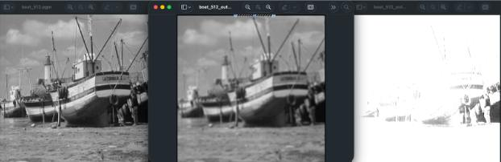
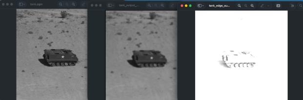

# CUDA-Accelerated-High-Performance-Library

CUDA lab project for matrix multiplication (CPU, naive CUDA, optimized CUDA, cuBLAS) and image convolution (CPU/GPU), plus a CUDA shared library callable from Python.

## Summary
This project starts from scratch with a baseline CPU matrix multiplication, then progressively moves to GPU: a naive CUDA kernel, a tiled shared-memory optimization, and finally cuBLAS. The goal is to understand how matrix size affects runtime and how each optimization improves speed. After establishing matrix performance, the project extends the same CUDA acceleration approach to image convolution (edge/blur filters), and exposes the GPU kernels through a shared library usable from Python.

## Image Comparisons



## Project Structure
- `matrix_cpu.c` — CPU matrix multiplication.
- `matrix_gpu.c` — naive CUDA matrix multiplication.
- `matrix_gpu_optimized.c` — tiled shared-memory CUDA matrix multiplication.
- `matrix_gpu_cublas.c` — cuBLAS matrix multiplication.
- `matrix_lib.cu` — CUDA shared library (matrix multiply + image convolution).
- `matrix_test.py` — Python test for the shared library.
- `image_convolution.c` — CPU image convolution (PGM P5 inputs).
- `image_convolution_gpu.c` — CUDA image convolution.
- `image_caller.py` — batch image convolution (cpu/gpu/python modes).
- `caller.py` — runs matrix benchmarks across multiple sizes.
- `commands.txt` — quick command reference.

## Requirements
- CUDA Toolkit (nvcc), cuBLAS
- GCC
- Python 3 with `numpy` and `Pillow`

## Build & Run

Matrix benchmarks (CPU / naive CUDA / optimized CUDA / cuBLAS):
```bash
gcc matrix_cpu.c -o matrix_cpu -O2
nvcc -x cu matrix_gpu.c -o matrix_gpu
nvcc -x cu matrix_gpu_optimized.c -o matrix_gpu_optimized
nvcc -x cu matrix_gpu_cublas.c -o matrix_gpu_cublas -lcublas

python3 caller.py
```

Shared library (CUDA -> Python):
```bash
nvcc -x cu -shared -Xcompiler -fPIC matrix_lib.cu -o libmatrix.so
python3 matrix_test.py --task matrix --sizes 512 1024 2048
```

Image convolution (CPU / GPU / Python library):
```bash
gcc image_convolution.c -o image_conv
./image_conv 5 blur boat_512.pgm boat_output_blur.pgm

nvcc -x cu image_convolution_gpu.c -o image_conv_gpu
./image_conv_gpu 5 blur boat_512.pgm boat_output_blur_gpu.pgm

python3 image_caller.py cpu
python3 image_caller.py gpu
python3 image_caller.py python
```

## Inputs / Outputs
- Example input images: `clock_256.pgm`, `boat_512.pgm`, `male_1024.pgm`.
- Output images are written to local files or folders created by `image_caller.py`.

## Notes
- Image convolution supports kernel sizes `N = 3, 5, 7` with `edge` and `blur` filters.
- The shared library exposes:
  - `matrix_multiply(float *h_A, float *h_B, float *h_C, int N)`
  - `convolute_image(unsigned char *h_input, unsigned char *h_output, int width, int height, int N, float *h_kernel)`

